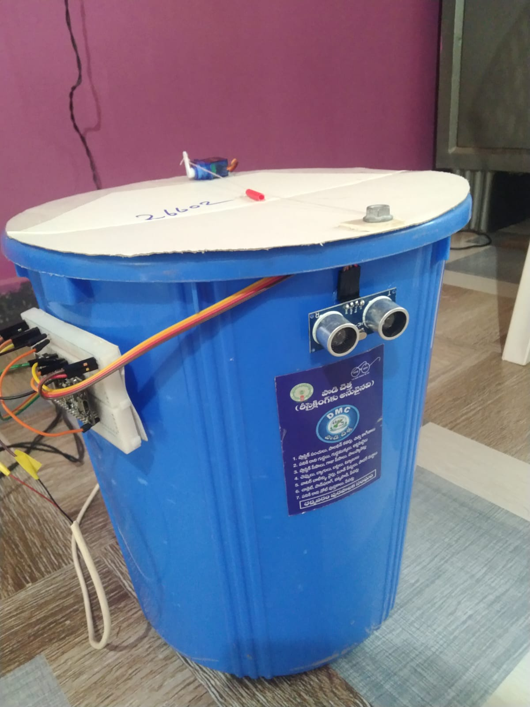
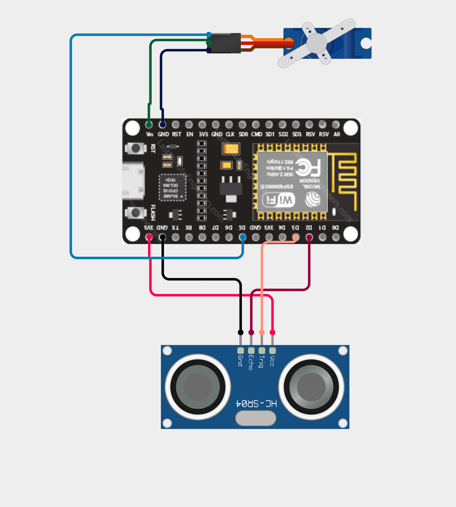

# Smart Dustbin

A touch-free dustbin that lifts its own lid when something comes close. An ultrasonic sensor watches the space in front of the bin, and a NodeMCU ESP8266 turns a servo motor to open the lid. A few seconds after the person moves away, the lid closes again.

> **Status:** Working prototype

## Prototype

## How it works

1. The HC-SR04 ultrasonic sensor measures the distance in front of the bin about ten times a second.
2. If an object is closer than 25 cm, the servo turns and lifts the lid.
3. The lid stays open while the object is there, and for 3 seconds after it leaves, so the lid does not flap while someone is throwing in waste.
4. After 3 seconds with nothing in front of the bin, the servo closes the lid.

## Components

| Component | Qty | Purpose |
|---|---|---|
| NodeMCU ESP8266 | 1 | Controller |
| HC-SR04 ultrasonic sensor | 1 | Detects an object in front of the bin |
| SG90 servo motor | 1 | Lifts and closes the lid |
| Dustbin with lid | 1 | Body of the project |
| Jumper wires, breadboard | - | Connections |
| 5 V USB supply | 1 | Power |

## Circuit

| NodeMCU pin | Connected to |
|---|---|
| 3V3 | HC-SR04 Vcc |
| GND | HC-SR04 Gnd and SG90 brown wire |
| D3 | HC-SR04 Trig |
| D2 | HC-SR04 Echo |
| Vin (5 V) | SG90 red wire |
| D5 | SG90 orange (signal) wire |

The sensor runs from the 3.3 V pin, so its Echo signal is 3.3 V and goes straight into the ESP8266 without a resistor. The servo runs from the 5 V Vin pin, which comes from the USB supply.

## Code

The full sketch is in [`code/code.ino`](code/code.ino).

To run it:

1. Open the file in the Arduino IDE. The ESP8266 board package must be installed, and it includes the `Servo` library.
2. Select **Board: NodeMCU 1.0 (ESP-12E Module)** and the correct port.
3. Upload.
4. Power the board and wave a hand in front of the sensor. The lid should lift.

### Settings you can change

These are at the top of the sketch:

| Setting | Default | Meaning |
|---|---|---|
| `OPEN_DISTANCE_CM` | 25 | The lid opens when something is closer than this |
| `CLOSED_ANGLE` | 0 | Servo angle with the lid closed |
| `OPEN_ANGLE` | 90 | Servo angle with the lid open |
| `HOLD_MS` | 3000 | How long the lid stays open after the object leaves |

Adjust the two angles until your lid closes fully and opens wide enough for your bin.

## Limitations

- The sensor is mounted on the front of the bin, so anything that comes close to it opens the lid, including a person just walking past.
- Running the sensor at 3.3 V can reduce its range on some HC-SR04 modules.
- This is a small prototype on a plastic bin. It has no way to tell when the bin is full.

## Possible improvements

- Add a second ultrasonic sensor inside the bin to measure how full it is
- Send a Wi-Fi notification when the bin needs emptying, since the ESP8266 already has Wi-Fi
- Use a more powerful servo for a heavier lid
- Add a small buzzer or LED that signals when the lid opens
